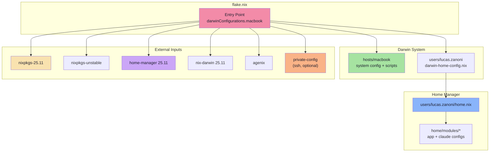

<h2 align="center"><a href="https://github.com/Castrozan" target="_blank" rel="noopener noreferrer">Zanoni's</a> Macbook Configs</h2>

<p align="center">
  
</p>

<p align="center">
   <a href="https://github.com/Castrozan/dotfiles-macbook/actions/workflows/tests.yml">
      
   </a>
   <a href="https://github.com/Castrozan/dotfiles-macbook/actions/workflows/nix-lint.yml">
      
   </a>
   
   <a href="https://github.com/nix-darwin/nix-darwin">
      
   </a>
</p>

Welcome to my macbook dotfiles! This repository contains my Apple Silicon laptop setup using **nix-darwin** + **home-manager**, with Claude Code agent infrastructure baked in. macOS only - the NixOS/Linux side lives in [castrozan/.dotfiles](https://github.com/castrozan/.dotfiles).

---

## Getting Started

<details>
<summary>
   <b>Quick Start for: 🍎 Apple Silicon Macbook</b>
</summary>

#### 1. Install Nix
```bash
curl --proto '=https' --tlsv1.2 -sSf -L https://install.determinate.systems/nix | sh -s -- install
```

#### 2. Clone the Repository
```bash
cd ~
git clone https://github.com/Castrozan/dotfiles-macbook.git .dotfiles
cd .dotfiles
```

#### 3. Customize Your Configuration
- Copy and modify `users/lucas.zanoni/` to your username
- Update `flake.nix` to add your configuration in `darwinConfigurations`
- Update `users.users.${username}` block in `hosts/macbook/default.nix` if needed

#### 4. Bootstrap nix-darwin
```bash
sudo nix run nix-darwin -- switch --flake .#macbook
```

#### 5. Subsequent rebuilds
```bash
darwin-rebuild switch --flake .#macbook
```
or use the wrapper:
```bash
./hosts/macbook/scripts/rebuild
```

</details>

---

## 🏗️ Architecture Overview

<details>
<summary>📦 mermaid</summary>



</details>

---

## 📂 Repository Structure

<details>
<summary>📂 Top-level structure</summary>

```
.dotfiles/
├── agents/              # Claude Code agent skills, hooks, and evaluations
│   ├── core.md          # Core agent behavior instructions
│   ├── skills/          # 12 umbrella skills (git, nix, session, browser, ...)
│   ├── hooks/           # Lifecycle hook scripts (format, lint, rebuild, review)
│   └── evals/           # Evaluation framework (baseline + per-skill configs)
├── home/                # Home Manager shared modules
│   └── modules/         # Application and feature modules (see below)
├── hosts/
│   └── macbook/         # nix-darwin system config: displays, finder, hotkeys,
│                        # window management, rebuild scripts, daemon scripts
├── lib/                 # Nix utility functions (nixgl-wrap, fetch-prebuilt-binary)
├── secrets/             # agenix-encrypted secrets (tokens, ssh hosts)
├── static/              # Themes (catppuccin, gruvbox, kanagawa, ...) + wallpapers
├── tests/               # Test suite (bats, pytest, nix-checks)
├── users/
│   └── lucas.zanoni/    # Home Manager + darwin user config
├── .githooks/           # Git pre-push and commit-msg hooks
├── .github/workflows/   # CI: tests.yml, nix-lint.yml, evals.yml
├── flake.nix            # Nix Flakes entry point
├── Makefile             # Helper commands
└── README.md            # This file!
```
</details>

<details>
<summary>📦 home/modules/ - all application modules</summary>

| Module | Description |
|--------|-------------|
| `agents` | Agent infrastructure shared between Claude Code and other tooling |
| `claude` | Claude Code: config, skills, MCP servers, hooks, plugins, scripts |
| `codex` | Codex CLI configuration |
| `desktop` | Clipboard, screenshots, notifications, fonts, desktop utilities |
| `dev` | Git, dev utilities |
| `editor` | Neovim, VSCode, Cursor, JetBrains IDEA |
| `media` | MPV, codecs, streaming, audio/video utilities |
| `network` | DNS, shell completions, network tooling |
| `security` | Keyrings, security scripts |
| `terminal` | Fish shell, tmux, kitty, wezterm, screensaver, terminal utilities |

Each module follows the same pattern: `default.nix` as entry point, optional `scripts/` for Python/shell utilities, optional `tests/` for BATS/pytest suites, optional `docs/` for module-specific documentation.
</details>

<details>
<summary>🤖 agents/ - Claude Code skills, hooks, and evaluations</summary>

`agents/core.md` is loaded into every Claude Code session and defines the authoritative agent behavior rules (code style, git discipline, tool preferences, workflow, etc.).

### Skills (`agents/skills/`)

Skills are organized as umbrella directories. Each umbrella has a `SKILL.md` (the skill the agent can invoke) plus sub-skill `.md` files and optional `scripts/`, `evals/`, and tests.

| Skill | Description |
|-------|-------------|
| `browser` | Live browser automation - fill forms, click buttons, test web UI, capture screenshots |
| `desktop` | macOS desktop automation, media control, screenshots, YouTube CLI |
| `git` | Commits, staging, commit message quality, history search |
| `glab` | GitLab merge requests, pipelines, code review |
| `jira` | Jira issues, sprints, epics, boards via jira-cli |
| `nix` | Nix language, module system, flakes, rebuild, devenv |
| `obsidian` | Obsidian vault, daily notes, TODO tracking, inbox processing |
| `research` | Current-information research, tool comparisons, external synthesis |
| `review` | Code review rubric, compliance auditing, documentation, skill authoring |
| `session` | Session lifecycle, deep work, worktrees, tmux, Claude Code instances |
| `test` | Testing methodology and verification workflow |
| `twitter` | X/Twitter scraping, posting, profile and tweet extraction |

### Hooks (`agents/hooks/`)

Python scripts wired as Claude Code lifecycle hooks:

| Hook | Trigger |
|------|---------|
| `auto-format.py` | After editing - runs ruff, nixfmt, shfmt |
| `lint-on-edit.py` | On file edit - runs language-appropriate linter |
| `nix-rebuild-trigger.py` | After editing `.nix` files - queues rebuild |
| `core-instruction-reinforcement.py` | Session start - injects core rules |
| `deep-work-recovery.py` | Session start - resumes active deep-work context |
| `session-context.py` | Session start - injects workspace/git/env context |
| `branch-protection.py` | Pre-tool - blocks edits on protected branches |
| `dangerous-command-guard.py` | Pre-tool - blocks destructive bash commands |
| `end-of-work-compliance-review.py` | Task completed - spawns parallel reviewers |
| `task-completed-quality-gate.py` | Task completed - quality gate before responding |
| `teammate-idle-quality-gate.py` | Teammate idle - reviews subagent output |
| `pre-push-ci-gate.py` | Pre-push - runs CI checks before git push |
| `tmux-reminder.py` | Session start - injects tmux session context |
| `url-to-skill-router.py` | On URL input - routes to matching skill |
| `run-hook.sh` | Shell wrapper for hook execution |

### Evals (`agents/evals/`)

Evaluation infrastructure for measuring agent behavior quality:

- `run-evals.py` - Eval runner (batch, single, or filter by tag)
- `baseline.json` - Saved baseline scores
- `config/` - Eval configuration per skill/scenario set
- `validate-skill-frontmatter.sh` - Validates all SKILL.md have required fields

</details>

---

## 🔗 Inspiration & Credits

This setup is inspired by and borrows from:
- <a href="https://github.com/Castrozan/.dotfiles" target="_blank" rel="noopener noreferrer">castrozan/.dotfiles</a> - The NixOS/Linux sibling of this repo
- <a href="https://github.com/ryan4yin/nix-config" target="_blank" rel="noopener noreferrer">ryan4yin/nix-config</a> - Excellent complex Nix configurations
- The amazing nix-darwin and Home Manager communities
- And countless other dotfiles repos I've stumbled upon at 3 AM 🌙

## 📚 Resources

- <a href="https://nix-darwin.github.io/nix-darwin/manual/" target="_blank" rel="noopener noreferrer">nix-darwin Manual</a> - Official documentation
- <a href="https://nix-community.github.io/home-manager/" target="_blank" rel="noopener noreferrer">Home Manager Manual</a> - Home Manager docs
- <a href="https://nixos.org/guides/nix-pills/" target="_blank" rel="noopener noreferrer">Nix Pills</a> - Learn Nix the fun way
- <a href="https://github.com/ryan4yin/nixos-and-flakes-book" target="_blank" rel="noopener noreferrer">NixOS & Flakes Book</a> - Comprehensive guide

---

Enjoy ricing and happy hacking! If you like this setup, consider giving it a ⭐
